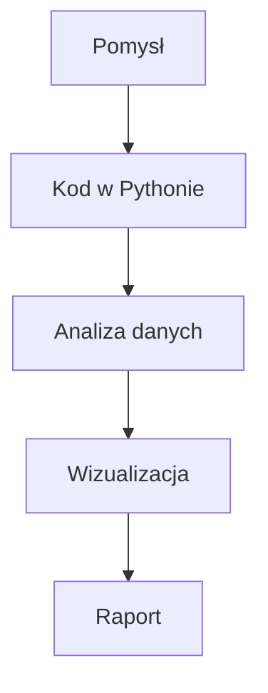

# Piotr Wdowiński

## O mnie
Studiuję Analitykę danych w biznesie na Politechnice Opolskiej, semestr 2.

## Zainteresowania
- Siłownia  
- Inwestowanie/Ekonomia
- Informatyka
- Strzelectwo
- Czytanie książek

## Umiejętności techniczne
| Narzędzie | Poziom |
|-----------|--------|
| Python    | średni |
| Excel     | średni |
| SQL       | początkujący |
| C++       | średni |
| PHP       | średni |

## Czego chcę się nauczyć
1. Poznać środowisko pracy
2. Poznać lepiej Pythona
3. Poznać asemblera

## Kontakt
- GitHub: [Wdowik](https://github.com/Wdowik)
- Email: wdowikson1234@gmail.com

## Mój workflow

